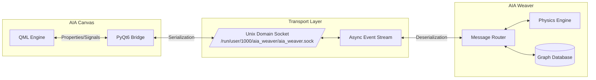
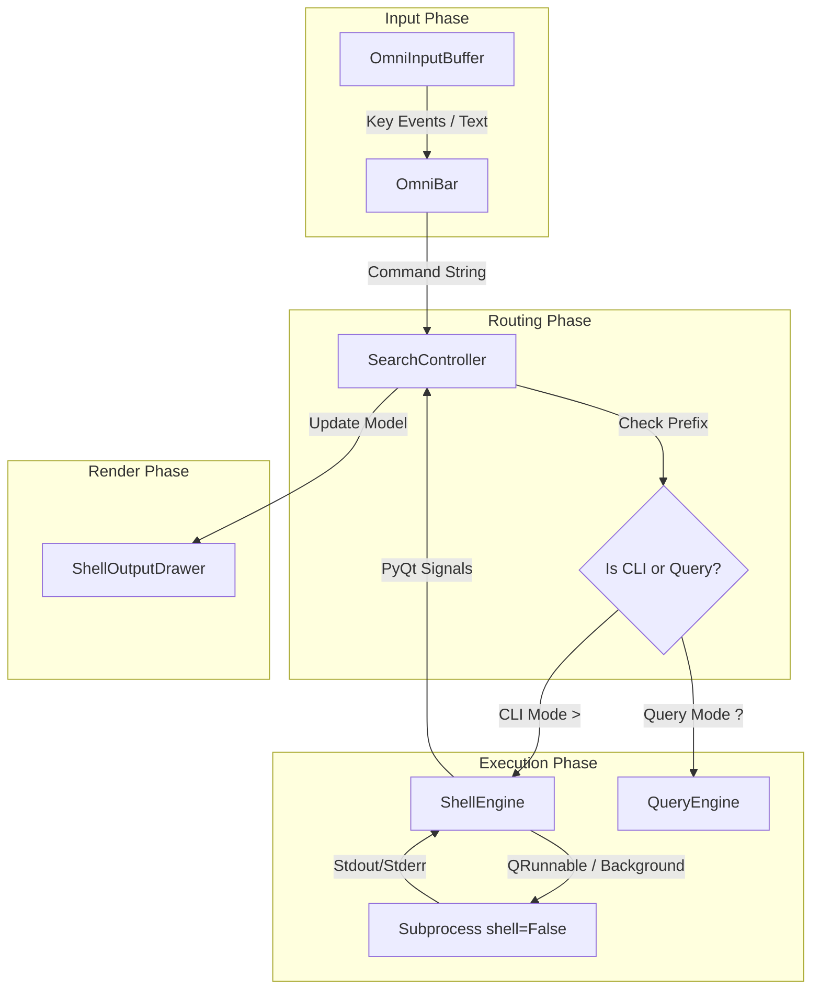
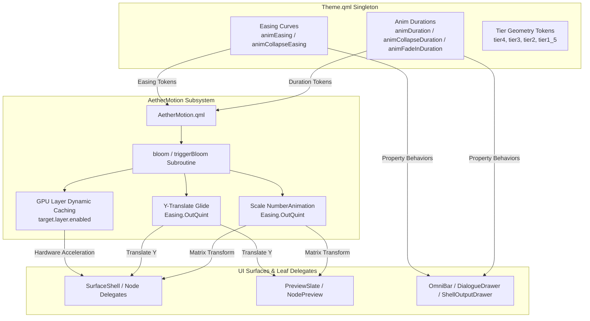

# Aether Architecture Documentation

This document outlines the architecture and data flows within the Aether project. It provides visual mappings of our core subsystems.

## 1. IPC Pipeline

The IPC Pipeline handles startup and synchronization data flow between the `aia_canvas` frontend (QML/PyQt) and the `aia_weaver` backend engines via Unix domain sockets.

## 2. OmniBar Command Execution Flow

This diagram maps the verified query and CLI command execution pipeline. It traces the lifecycle of an input from the buffer, through the SearchController, to background execution via the ShellEngine, and finally rendering in the ShellOutputDrawer.

## 3. Modernized Motion Subsystem & Token Architecture

The motion architecture is centralized in `AetherMotion.qml` and driven by single-source-of-truth design tokens defined in `Theme.qml`. Dimensional blooms (Tier 4 -> Tier 3 -> Tier 2 -> Tier 1.5) rely on GPU hardware-accelerated scale matrices and Y-translations instead of CPU layout property animation, ensuring silky 120-240 FPS rendering.

### 3.1 Key Motion Invariants
- **Token Centralization:** Animation durations (`Theme.animDuration`, `Theme.animCollapseDuration`, `Theme.animFadeInDuration`) and easing curves (`Theme.animEasing`, `Theme.animCollapseEasing`) are maintained single-source in `Theme.qml`.
- **GPU Matrix Blooming:** Visual expansions snap CPU layout boundaries (`0` duration) and execute GPU transform matrix scaling (`target.scale` and `Translate.y`), avoiding expensive QML layout reflows during scale blooms.
- **Dynamic Layer Caching:** `target.layer.enabled` is dynamically toggled high only while `isAnimating` is true, keeping GPU texture memory footprint minimal during steady state.

## 4. Modernized HUD Architecture

The HUD layer (`hudOverlayLayer`, `z: 10`) houses floating interactive controls, search carousels, command entry, and telemetry overlays air-gapped from the spatial physics canvas.

- **`OmniBar.qml`:** Central intent coordinator (`z: 100`) hosting subcomponents for input, suggestion ribbons, LLM dialogue slates, and command execution output.
  - **`OmniInputCapsule.qml`:** Frameless obsidian pill entry buffer with dynamic mode sigil indicator (`/` system, `?` query, `>` shell command).
  - **`SearchSuggestionRibbon.qml`:** Auto-complete suggestion carousel providing instant inline keyboard navigation.
  - **`DialogueDrawer.qml`:** Collapsible slate for real-time LLM token streaming and conversational turn history.
  - **`ShellOutputDrawer.qml`:** Terminal drawer rendering live stdout/stderr streams, ANSI color codes, and shell execution status.
  - **`ProviderBadge.qml`:** Frameless status badge displaying the provider SVG icon (far left), model display name, and active streaming indicator dot (far right).
- **`SearchShelf.qml`:** Spotlight carousel (`z: 10000`) for non-modal graph searching and Tier 1.5 in-canvas dwell inspection.
- **`DiagnosticsOverlay.qml`:** SRE telemetry overlay (`F3`) tracking physics frametimes, edge counts, IPC payload latencies, and ring buffer statistics.
- **`CanvasHud.qml`:** Bottom-left ambient status pill rendering real-time socket connection health and cognitive aperture zoom metrics.

