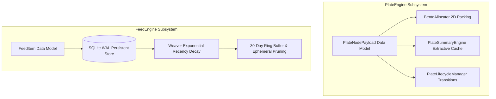
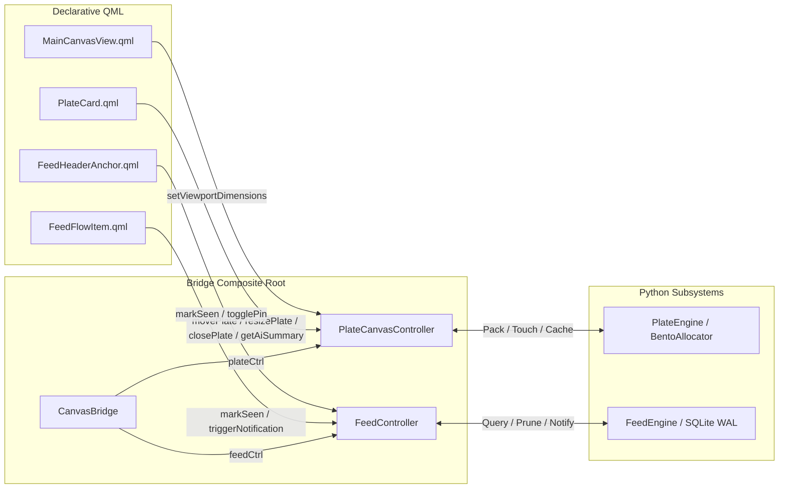

# Aether System Architecture

## 1. System Topology & Spatial Philosophy

Aether is a post-WIMP spatial environment designed for cognitive calm, ambient awareness, and intent-driven interaction. The system departs fundamentally from conventional desktop metaphors (overlapping windows, title bars, maximize/minimize chrome, and rigid multi-monitor bounds) in favor of a cohesive spatial workspace where information is organized into bounded plates and temporal streams.

```text
┌─────────────────────────────────────────────────────────────────────────┐
│                           AETHER ECOSYSTEM                              │
│                                                                         │
│   ┌──────────────────┐                                                  │
│   │   aia_weaver     │  Posix Metadata, Semantic Graph & SQLite WAL     │
│   │(Knowledge Fabric)│                                                  │
│   └────────▲─────────┘                                                  │
│            │ JSON-RPC / Domain Sockets                                  │
│   ┌────────▼─────────┐                                                  │
│   │  Core Engines    │  PlateEngine, BentoAllocator, FeedEngine         │
│   │  (Dumb Engines)  │  Mass Calculation, 30-Day Decay, Grid Packing    │
│   └────────▲─────────┘                                                  │
│            │ Composite Root (CanvasBridge)                              │
│   ┌────────▼─────────┐                                                  │
│   │ QML Controllers  │  PlateCanvasController, FeedController           │
│   │ (Bridge Layer)   │  Reactive Properties, Signals, Invokable Slots   │
│   └────────▲─────────┘                                                  │
│            │ Property Bindings & Declarative Delegates                  │
│   ┌────────▼─────────┐                                                  │
│   │  Stage 0 QML UI  │  MainCanvasView, Bento Canvas, Feed, Horizon Bar │
│   │    (Thin UI)     │  Zero Hardcoded Pixels, 120 FPS Native Motion    │
│   └──────────────────┘                                                  │
└─────────────────────────────────────────────────────────────────────────┘
```

### 1.1 Post-WIMP Spatial Paradigm
Traditional desktop interfaces force users to act as manual window managers—positioning, resizing, stacking, and searching across cluttered windows. Aether eliminates window chrome:
- **Bounded Plates:** Active artifacts (documents, code, media, live telemetry, monospace logs) render inside structured, auto-allocated `PlateCard` containers.
- **Continuous Temporal Streams:** Ambient events, communications, notifications, and git commits flow along a continuous temporal axis (`The Feed`) rather than interrupting the user with modal popups.
- **Intent-Driven Dispatch:** User focus transitions through direct semantic queries, prefix commands, or spatial dwell rather than file hierarchies.

### 1.2 Stage 0 Ambient Equilibrium
The default resting state of the canvas is **Stage 0 Equilibrium**:
- **Baseline Contrast:** The palette is anchored in deep obsidian tones (`#070A0F`, `#0B111A`) with subtle border luminosity (`#1A2433`) that matches human foveal comfort.
- **Calm Kinetic Silence:** When idle, the interface displays zero unprompted motion, zero pulsing animations, and zero CPU-burning polling loops.
- **Visual Balance:** Sacred zones maintain optical equilibrium—no single zone or card overpowers peripheral attention until explicit user dwell, hover, or intent is asserted.

### 1.3 Dumb Engines / Thin UI Invariant
The architecture enforces strict separation between domain state and presentation:
- **Dumb Computational Engines:** All domain logic, grid occupancy algorithms, recency half-life curves, text distillation, and lifecycle state machines execute strictly within Python domain engines (`PlateEngine`, `BentoAllocator`, `FeedEngine`).
- **Thin Presentation Views:** QML delegates (`PlateCard.qml`, `FeedFlowItem.qml`, `FeedHeaderAnchor.qml`) are stateless presentation leaves. They bind reactively to controller properties and dispatch user intents upstream via controller `@pyqtSlot` methods. No business calculations, layout packing, or storage operations occur inside QML.

---

## 2. Spatial Layout & Sacred Zones (Master Shell)

The master visual shell (`MainCanvasView.qml`) organizes the entire display into four mutually isolated **Sacred Zones**.

```text
┌───────────────────────────────────────────────────────────────────────────────┐
│ GLOBAL HORIZON BAR  (~4.8% height)    NIC // WORKSPACE  [Plates: 4] [Unread: 1] 14:32 │
├───────────────────────────────────────────────────────────────┬───────────────┤
│                                                               │ THE FEED      │
│  SPATIAL BENTO CANVAS (~79.0% width)                          │ FRAME         │
│                                                               │ (~18.5% width)│
│  ┌─────────────────────────┐  ┌─────────────────────────────┐ │ ┌───────────┐ │
│  │ PlateCard (Focal)       │  │ PlateCard (Satellite)       │ │ │Micro-Pill │ │
│  │ [docs/spec.md]          │  │ [backend_telemetry.log]     │ │ │Anchors    │ │
│  │ AI Summary Drawer       │  │ Monospace live container    │ │ ├───────────┤ │
│  │                         │  │                             │ │ │Flow Item  │ │
│  ├─────────────────────────┤  └─────────────────────────────┘ │ │(full tier)│ │
│  │ PlateCard (Terminal)    │  ┌─────────────────────────────┐ │ │           │ │
│  │ [make test-unit]        │  │ PlateCard (Media)           │ │ ├───────────┤ │
│  │ Live monospace tty      │  │ [architecture_diagram.png]  │ │ │Flow Item  │ │
│  └─────────────────────────┘  └─────────────────────────────┘ │ │(compact)  │ │
│                                                               │ │           │ │
│                 ┌───────────────────────────┐                 │ ├───────────┤ │
│                 │      OMNIBAR ANCHOR       │                 │ │Flow Item  │ │
│                 │   (~5.8% h, ~50% w)       │                 │ │(fading)   │ │
│                 └───────────────────────────┘                 │ └ ~ ~ ~ ~ ┘ │
└───────────────────────────────────────────────────────────────┴───────────────┘
```

### 2.1 Zone Geometry Specifications
- **Global Horizon Bar (Top ~4.8% viewport height, ratio `0.048`):**
  - Continuous horizontal telemetry strip pinned to the top viewport edge.
  - Hosts user/session identity ("NIC // WORKSPACE"), active plate metrics, feed unread counter, system performance diagnostics, and a live updating clock.
  - Never scrolls, translates, or gets occluded by canvas plates.
- **Spatial Bento Canvas (Left/Center ~79.0% viewport width, ratio `0.790`):**
  - Primary interactive workspace hosting active `PlateCard` components arranged via `BentoAllocator`.
  - Strictly clipped (`clip: true`) with guaranteed zero-bleed into the Horizon Bar, Feed Frame, or OmniBar capsule.
  - Synchronizes dynamic dimensions directly to `PlateCanvasController.setViewportDimensions(width, height)`.
- **The Feed Frame (Right ~18.5% viewport width, ratio `0.185`):**
  - Temporal stream container dropped cleanly below the Horizon Bar (~2.2% vertical spacing) so its top aligns with the upper row of Bento plates.
  - Upper section: Pinned micro-pill ribbons (`FeedHeaderAnchor.qml`) displaying persistent channels, active streams, and unread indicators.
  - Lower section: 30-day temporal rolling stack (`FeedFlowItem.qml`) with bottom opacity fade terminating above the bottom search area.
- **OmniBar Anchor (Bottom Center ~5.8% viewport height, ~50% width):**
  - Dedicated anchor capsule container centered horizontally above the bottom viewport edge.
  - Hosts the spotlight search and command dispatcher (`Ctrl + Space`), expanding smoothly into query results and conversational surfaces without shifting Bento canvas boundaries.

### 2.2 Sizing & Scaling Invariants
- **Strict Dynamic Scaling:** Absolute zero hardcoded pixel traps. All widths, heights, margins, and paddings derive dynamically from parent dimensions, viewport ratios, and token metrics.
- **Sacred Zone Isolation:** Plates and floating dialogs respect zone boundaries through strict clipping and layout clamping. No spatial plate can push into or overlap the Horizon Bar or Feed Frame during layout reflows.

---

## 3. Core Subsystems & Engines


```mermaid
graph TD
    subgraph PlateSubsystem [PlateEngine Subsystem]
        PNP[PlateNodePayload Data Model]
        BA[BentoAllocator 2D Packing]
        PSE[PlateSummaryEngine Extractive Cache]
        PLM[PlateLifecycleManager Transitions]
    end

    subgraph FeedSubsystem [FeedEngine Subsystem]
        FI[FeedItem Data Model]
        FDB[(SQLite WAL Persistent Store)]
        EXP[Weaver Exponential Recency Decay]
        PRN[30-Day Ring Buffer & Ephemeral Pruning]
    end

    PNP --> BA
    PNP --> PSE
    PNP --> PLM

    FI --> FDB
    FDB --> EXP
    EXP --> PRN
```

### 3.1 PlateEngine & BentoAllocator
`aia_canvas/src/plate_engine/` orchestrates spatial artifacts and layout geometry:
- **Canonical Plate Model (`PlateNodePayload`):**
  - Strongly typed representation containing identity (`node_id`), archetype classification (`document`, `code`, `log`, `media`, `chat`), temporal tracking (`created_at`, `last_accessed_at`, `touch_count`), spatial preferences (`is_pinned`, `is_user_placed`), and extensible `metadata`.
- **Dynamic Bento Grid Packing (`BentoAllocator`):**
  - Computes 2D occupancy grid allocations based on cognitive mass and viewport boundaries.
  - Calculates coordinate geometry (`x`, `y`, `width`, `height`, `col_start`, `col_span`, `row_start`, `row_span`) preserving optimal aspect ratios.
  - Dynamic responsive reconfiguration: reflows unpinned plates smoothly when viewport dimensions change or plates are added/closed, while preserving user-placed coordinates for manually positioned plates.
- **Single-Key Summary Cache (`ai_summary`):**
  - Standardized fast-path lookup directly into `plate.metadata["ai_summary"]`.
  - When missing, `PlateSummaryEngine` computes an extractive 2-sentence distillation from raw file contents/metadata and caches it under `metadata["ai_summary"]`, preventing redundant LLM round-trips.
- **Temporal Touch & Pin Protections:**
  - Every spatial interaction (selection, resize, move, inspect) updates `last_accessed_at` via `temporal.touch()`.
  - `is_pinned = True` shields high-priority plates against automatic lifecycle decay and desktop sweep operations.

### 3.2 FeedEngine
`aia_canvas/src/plate_engine/feed_engine.py` manages the chronological and notification stream:
- **30-Day Sliding Buffer:**
  - Configured with `FeedConfig.active_window_seconds = 30 * 86400.0`.
  - Prunes items older than 30 days while respecting pinned status (`is_pinned`) and maximum ring buffer capacity (`max_items = 200`).
- **Weaver Exponential Half-Life Decay:**
  - Recency score computed via half-life formulation:
    $$S(t) = 2^{-\Delta t / t_{1/2}}$$
    where $\Delta t$ is elapsed time from item timestamp and $t_{1/2}$ is the recency half-life (default 7 days).
- **Graduated Visual Tiers:**
  - `full`: High-salience card displaying title, author/source, multi-line preview snippet, source tags, and inline action buttons.
  - `compact`: Streamlined horizontal card with title, single-line preview snippet, and compact relative timestamp.
  - `fading`: Low-opacity entry (`opacity: 0.44`, elevating to 1.0 on hover) conserving cognitive budget for older items in the 30-day temporal stack.
- **Ambient Notification System:**
  - **Left-Dot Invariant:** Unread notification dot (`has_dot = True`) is positioned strictly to the **LEFT** of the item icon/emoji inside micro-pills and flow items.
  - **Ambient Border Glow (`is_active_glow`):** Subtle border luminosity indicating live stream activity or urgent communication.
  - Calling `markSeen(itemId)` atomically clears both `has_dot` and `is_active_glow`.
- **Persistence & Ephemeral Pruning:**
  - High-performance SQLite backing with Write-Ahead Logging (WAL) and memory caching.
  - Ephemeral alerts specify a finite `ttl_seconds` and are automatically pruned on engine maintenance sweeps.

---


## 4. Controllers & QML Bridge Layer

The presentation layer decouples QML views from backend computational engines via domain controllers registered through `CanvasBridge` (Composite Root) and exposed into the QML engine context.


```mermaid
graph LR
    subgraph Views [Declarative QML]
        MCV[MainCanvasView.qml]
        PC[PlateCard.qml]
        FHA[FeedHeaderAnchor.qml]
        FFI[FeedFlowItem.qml]
    end

    subgraph Bridge [Bridge Composite Root]
        CB[CanvasBridge]
        PCC[PlateCanvasController]
        FC[FeedController]
    end

    subgraph Engines [Python Subsystems]
        PE[PlateEngine / BentoAllocator]
        FE[FeedEngine / SQLite WAL]
    end

    MCV -->|setViewportDimensions| PCC
    PC -->|movePlate / resizePlate / closePlate / getAiSummary| PCC
    FHA -->|markSeen / togglePin| FC
    FFI -->|markSeen / triggerNotification| FC

    CB -->|plateCtrl| PCC
    CB -->|feedCtrl| FC

    PCC <-->|Pack / Touch / Cache| PE
    FC <-->|Query / Prune / Notify| FE
```

### 4.1 PlateCanvasController
- **Module Path:** `aia_canvas/src/controllers/plate_controller.py`
- **Inheritance:** `BaseController` -> `QObject`
- **Engine Bridged:** `PlateEngine` (`bento.py`, `models.py`, `parser.py`, `summary_engine.py`, `lifecycle.py`)
- **QML Context Name:** `plateCanvasController` (also accessible via `bridge.plateCtrl` / `bridge.plate`)

#### Reactive QML Properties
| Property | Type | Notify Signal | Description |
| :--- | :--- | :--- | :--- |
| `activePlates` | `QVariantList` (`list[dict]`) | `activePlatesChanged` | Active canvas plates with serialized metadata, geometry, lifecycle status, and top-level `ai_summary`. |
| `bentoGeometry` | `QVariantList` (`list[dict]`) | `bentoGeometryChanged` | Resolved Bento grid layout records (`node_id`, `col_start`, `col_span`, `row_start`, `row_span`, `x`, `y`, `width`, `height`). |
| `focalPlateId` | `int` | `focalPlateChanged` | Node identifier currently occupying Tier 1 focal center stage (`0` if none). |
| `plateCount` | `int` | `activePlatesChanged` | Total count of active interactive plates currently allocated on the canvas. |

#### Invokable `@pyqtSlot` Interfaces
- `movePlate(int nodeId, real x, real y) -> bool`: Coordinates translation, sets `temporal.is_user_placed = True`, updates temporal touch, and emits `plateMoved(nodeId, x, y)`.
- `resizePlate(int nodeId, real width, real height) -> bool`: Resizes plate with safety bounds (`width >= 120px`, `height >= 80px`), marks user-placed, and emits `plateResized(nodeId, width, height)`.
- `pinPlate(int nodeId, bool isPinned = True) -> bool`: Toggles `temporal.is_pinned`, shielding plate from automatic decay sweeps, and emits `platePinned(nodeId, isPinned)`.
- `togglePin(int nodeId) -> bool`: Convenience method inverting the current pin state.
- `closePlate(int nodeId) -> bool`: Dismisses plate, triggers automatic Bento reflow, and emits `plateClosed(nodeId)`.
- `getAiSummary(int nodeId) -> str` / `ai_summary(int nodeId) -> str`: Cache-first lookup into `metadata["ai_summary"]`. Falls back to `PlateSummaryEngine` 2-sentence extractive distillation, updates the cache, and emits `summaryUpdated(nodeId, summary)`.
- `addPlate(variant payload) -> int` / `openPlate(variant payload) -> int`: Ingests plate payload with explicit `is not None` parsing, triggers Bento packing, and emits `plateOpened(nodeId)`.
- `recalculateBento()`: Runs 2D occupancy grid packing across active plates.
- `setViewportDimensions(real width, real height)`: Synchronizes viewport resolution with `BentoGridConfig` and initiates grid re-packing.
- `selectPlate(int nodeId)`: Sets focal plate focus and emits `focalPlateChanged(nodeId)`.
- `clearAll()`: Purges all active plates and resets focal stage.

### 4.2 FeedController
- **Module Path:** `aia_canvas/src/controllers/feed_controller.py`
- **Inheritance:** `BaseController` -> `QObject`
- **Engine Bridged:** `FeedEngine` (`feed_engine.py`)
- **QML Context Name:** `feedController` (also accessible via `bridge.feedCtrl` / `bridge.feed`)

#### Reactive QML Properties
| Property | Type | Notify Signal | Description |
| :--- | :--- | :--- | :--- |
| `headerAnchors` | `QVariantList` (`list[dict]`) | `headerAnchorsChanged` | Pinned items (`is_pinned = True`) sorted by priority, recency, and timestamp for header micro-pills. |
| `flowStack` | `QVariantList` (`list[dict]`) | `flowStackChanged` | 30-day rolling items with exponential recency decay and graduated view tiers (`full`, `compact`, `fading`). |
| `unreadCount` | `int` | `unreadCountChanged` | Count of items currently marked with active glow (`is_active_glow = True`) or unread dot (`has_dot = True`). |
| `totalCount` | `int` | `flowStackChanged` | Total count of all feed items retained in the backing memory/SQLite index. |

#### Invokable `@pyqtSlot` Interfaces
- `markSeen(string itemId) -> bool`: Atomically clears unread dot and active glow states, emits `itemNotificationChanged(itemId, False, False)`, and updates `unreadCount`.
- `triggerNotification(string itemId, bool glow = True, bool dot = True) -> bool`: Activates ambient glow and unread indicator dot, emits `itemNotificationChanged(itemId, glow, dot)`, and updates `unreadCount`.
- `refresh()` / `refreshFeed()`: Enforces ephemeral TTL timeouts, 30-day sliding window expiration, and ring buffer capacity constraints, emitting `feedRefreshed()`.
- `pinItem(string itemId, bool isPinned = True) -> bool`: Sets pin state, promoting or evicting item from `headerAnchors`.
- `unpinItem(string itemId) -> bool`: Convenience method to unpin an item.
- `togglePin(string itemId) -> bool`: Inverts pin status.
- `addItem(variant itemData) -> str`: Ingests feed item using explicit `is not None` parsing, persists to SQLite, and emits `itemAdded(itemId)`.
- `removeItem(string itemId) -> bool`: Evicts item from memory and backing SQLite, emitting `itemRemoved(itemId)`.
- `getItem(string itemId) -> dict`: Returns serialized feed item payload with camelCase and snake_case field access.
- `clearAll()`: Purges all items from the active feed session.


---

## 5. Interaction & Ambient State Machines

```text
┌─────────────────────────────────────────────────────────────────────────┐
│                    INTERACTION STATE MACHINE                            │
│                                                                         │
│   ┌───────────────────────────┐  Cursor Enters Pill / Item              │
│   │   STAGE 0 EQUILIBRIUM     │─────────────────────────┐               │
│   │   Resting Contrast        │                         ▼               │
│   │   Zero Unprompted Motion  │              ┌──────────────────────┐   │
│   └─────────────▲─────────────┘              │   HOVER-TO-GROW      │   │
│                 │                            │   Fluid GPU Scaling  │   │
│                 │ Cursor Exits               │   Border Highlight   │   │
│                 │                            └──────────┬───────────┘   │
│                 │                                       │ Dwell >= 320ms│
│                 │                                       ▼               │
│                 │                            ┌──────────────────────┐   │
│                 │ Popover Dismissed          │   DWELL-TO-PREVIEW   │   │
│                 └────────────────────────────│   Floating Popover   │   │
│                                              │   Context & Summary  │   │
│                                              └──────────────────────┘   │
└─────────────────────────────────────────────────────────────────────────┘
```

### 5.1 Stage 0 Baseline Contrast & Equalized Balance
- **Visual Balance:** Resting visual elements adhere to optical equalization:
  - Background: Deep obsidian canvas (`Theme.obsidianVoid` `#070A0F`).
  - Card Surfaces: Deep charcoal-blue tinted surfaces (`Theme.surfaceDark` `#0B111A`) with soft subtle borders (`Theme.borderSubtle` `#1A2433`).
  - Accentuation: Color accents (cyan `#00E5FF`, violet `#8A2BE2`, amber `#FFB300`) appear only as functional telemetry tags, indicator dots, or active borders—never as broad garish fills.
- **Calm Cognitive Space:** In the absence of user interaction, the visual field remains completely stable. No continuous animations, rotating spinners, or intrusive toasts are permitted.

### 5.2 Hover-to-Grow & 320ms Dwell-to-Preview
- **Hover-to-Grow Transition:**
  - Micro-pills (`FeedHeaderAnchor.qml`) and flow cards (`FeedFlowItem.qml`) respond to cursor hover with a swift, fluid GPU scale expansion (1.0 -> 1.04) and subtle border luminosity elevation.
  - Transitions use `Theme.animDuration` (~200ms) with `Easing.OutQuint` curves.
- **320ms Dwell-to-Preview Popovers:**
  - When the cursor dwells stationary over a micro-pill or flow item for **$\ge 320\text{ms}$**, an ambient floating preview popover spawns adjacent to the anchor.
  - The popover renders stream context, latest message snippets, or cached AI summary (`ai_summary`) without requiring a click or mode switch.
  - Moving the cursor away cleanly cancels the timer and dissolves the preview popover without layout reflow.

### 5.3 Monospace Terminal Container Plate Rule
- **The Rule:** Live shell output, logs (e.g. `infra_deploy.log`, build outputs, test runner streams), and terminal sessions must **ALWAYS** render inside a dedicated container plate (`PlateCard.qml`) equipped with:
  - Strict monospace typography (`Theme.fontCode`).
  - Monospace line spacing and ANSI color mapping.
  - Bounded container constraints (`clip: true`) with internal vertical scroll/flickable.
  - Header chrome displaying the command, file path, live status indicator, and pin/close controls.
- **Canvas Invariant:** System logs and stdout streams are **NEVER** dumped as raw, uncontained text directly onto the open canvas. Monospace content is strictly isolated within card geometries to prevent visual fragmentation and preserve Stage 0 balance.

